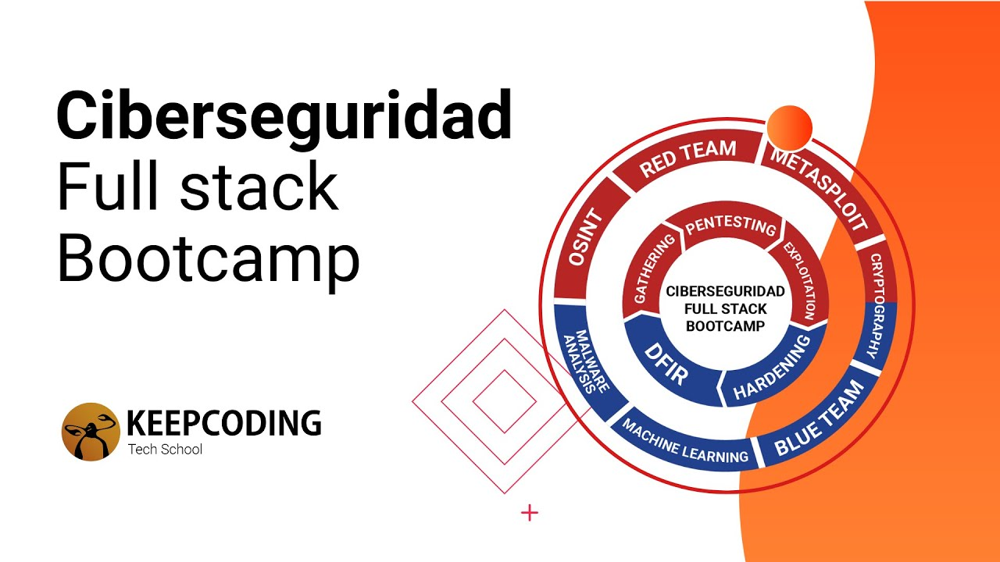

# KeepCoding-reports

Repository where my reports made in the different modules of the bootcamp "Cybersecurity Full Stack" taken at KeepCoding are stored.  

  

### Modules

- Introduction to Cybersecurity 
- Cryptography
- Blue Team
- Information Gathering
- Pentesting
- Machine Learning & Cybersecurity
- Digital Forensic and Incident Response
- Malware analysis
- Red Team
